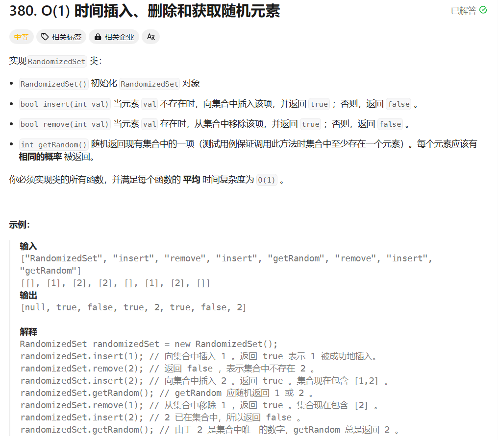
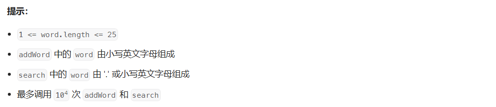
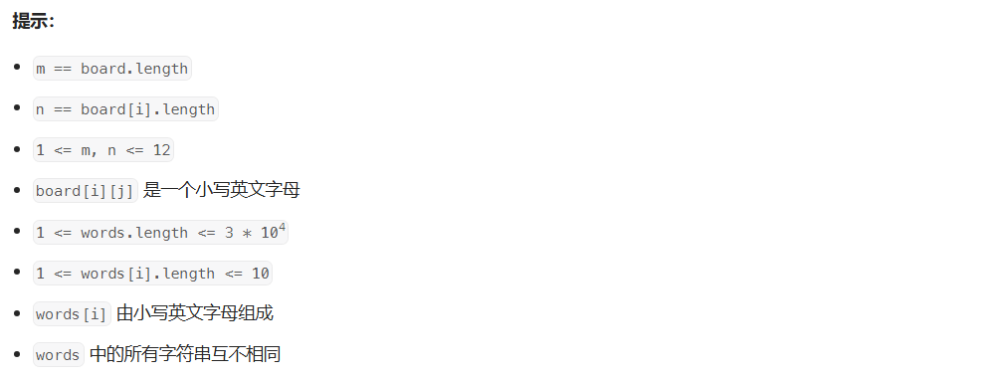

# 面试经典150题

## 1 数组/字符串

### 274 H指数


+ 先将数组从小到大排序
+ 从后往前遍历，如果`citations[i] >= citations.size() - i `，则H指数加一，否则，结束遍历

```c++
class Solution {
public:
    int hIndex(vector<int>& citations) {
        sort(citations.begin(), citations.end());
        int ans = 0;
        for(int i = citations.size() - 1; i >= 0; i--){
            if(citations[i] >= citations.size() - i)
                ans++;
            else
                break;
        }
        return ans; 
    }
};
```


### 380 $O(1)$时间插入、删除和获取随机元素




```c++
class RandomizedSet {
public:
    unordered_map<int, int> num2idx;
    vector<int> nums;

    RandomizedSet() {

    }
    
    bool insert(int val) {
        if(num2idx.find(val) == num2idx.end()){
            nums.push_back(val);
            num2idx[val] = nums.size() - 1;
            return true;
        }
        return false;    
    }
    
    bool remove(int val) {
        if(num2idx.find(val) != num2idx.end()){
            int idx = num2idx[val];

            num2idx[nums.back()] = idx;
            nums[idx] = nums.back();

            nums.pop_back();
            num2idx.erase(val); 
            return true;
        }  
        return false;
    }
    
    int getRandom() {
        int rnd = rand() % num2idx.size();
        return nums[rnd];
    }
};

/**
 * Your RandomizedSet object will be instantiated and called as such:
 * RandomizedSet* obj = new RandomizedSet();
 * bool param_1 = obj->insert(val);
 * bool param_2 = obj->remove(val);
 * int param_3 = obj->getRandom();
 */
```


### 13 罗马数字转整数


```c++
class Solution {
public:
    int romanToInt(string s) {
        unordered_map<char, int> map = {
            {'I', 1}, 
            {'V', 5}, 
            {'X', 10}, 
            {'L', 50}, 
            {'C', 100}, 
            {'D', 500}, 
            {'M', 1000}
        };

        int ans = 0;
        // 从后往前遍历
        for(int i = s.size() - 1; i >= 0; i--){
            // 如果当前字母表示的数小于后一个字母，即存在类似 "IV"表示4的情况
            // 在总和上减去当前字母代表的值
            if(i < s.size() - 1 && map[s[i]] < map[s[i + 1]])
                ans -= map[s[i]];
            else
                ans += map[s[i]];
        }
        return ans;
    }
};
```


### 68 文本左右对齐


```c++
class Solution {
public:
    vector<string> fullJustify(vector<string>& words, int maxWidth) {
        vector<string> result;
        vector<string> line;
        int idx = 0;
        int lineLen = 0;
        while(idx < words.size()){
            // && 后面的那个条件比较很关键
            while(idx < words.size() && lineLen + words[idx].size() + line.size() <= maxWidth){
                line.push_back(words[idx]);
                lineLen += words[idx].size();
                idx ++;
            }
            string s;
            // 如果已经处理到最后一个单词
            // 最后一行单词之间只需要一个空格
            if(idx == words.size()){
                int cnt = maxWidth - lineLen - line.size() + 1;
                for(int i = 0; i < line.size() - 1; i++)
                    line[i] += ' ';
                for(int i = 0; i < cnt; i++)
                    line.back() += ' ';
                for(int i = 0; i < line.size(); i++)
                    s += line[i];
                
            }
            // 如果这一行只有一个单词，则直接在后面补空格
            else if(line.size() == 1){
                int cnt = maxWidth - line[0].size();
                s += line[0];
                for(int i = 0; i < cnt; i++)
                    s += ' ';
            }
            // 如果这一行有多个单词
            else {
                // cnt为每个单词需要均摊的空格数量
                int cnt = (maxWidth - lineLen) / (line.size() - 1);
				// rest为左边需要分摊剩余空格的单词数量
                int rest = (maxWidth - lineLen) % (line.size() - 1);
                for(int i = 0; i < line.size() - 1; i++){
                    for(int j = 0; j < cnt; j++)
                        line[i] += ' ';
                }
                for(int i = 0; i < rest; i++){
                    line[i] += ' ';
                }
                for(int i = 0; i < line.size(); i++)
                    s += line[i];
            }
            result.push_back(s);
            line.clear(), lineLen = 0;
        }
        return result;
    }
};
```


## 2 滑动窗口

### 30 串联所有单词的子串


> 回溯暴力解法（超时）

遍历每一个符合长度条件的子串，然后和`words`中的单词比较，看是否可以由其的一种排列构成

```c++
class Solution {
public:
    vector<int> result;
    int len;
    void backtracing(string s, vector<string>& words, int idx, int total, vector<bool>& used){
        if(total == words.size()){
            result.push_back(idx - len);
            return;
        }

        for(int i = 0; i < words.size(); i++){
            if(used[i]) continue;
            // 去重
            if(i > 0 && words[i] == words[i - 1] && used[i - 1] == false) continue;
            string tmp = s.substr(idx, words[i].size());
            if(tmp == words[i]){
                used[i] = true;
                backtracing(s, words, idx + words[i].size(), total + 1, used);
                used[i] = false;
            }
        }
    }
    
    vector<int> findSubstring(string s, vector<string>& words) {
        sort(words.begin(), words.end());
        for(int i = 0; i < words.size(); i++)
            len += words[i].size();
        vector<bool> used(words.size(), false);
        for(int i = 0; i < s.size() - len + 1; i++)
            backtracing(s, words, i, 0, used);
        return result;
    }
};
```

> 滑动窗口

这题有一个关键点在于：**`word`中所有单词长度是相同的**

可以用滑动窗口，窗口滑动的步长为单词的长度，并用一个`unordered_map`来记录窗口中的单词出现次数

```c++
class Solution {
public:
    // 比较两个map是否相等
    bool cmp(unordered_map<string, int>& map, unordered_map<string, int>& tmpMap){
        for(auto& kk : map){
            if(tmpMap.find(kk.first) == tmpMap.end())
                return false;
            if(tmpMap[kk.first] != kk.second)
                return false;
        }
        return true;
    }
    
    vector<int> findSubstring(string s, vector<string>& words) {
        int lenWord = words[0].size();
        int lenTot = lenWord * words.size();
        int lens = s.size();
        vector<int> ans;

        // 记录words中各个单词出现的数量
        unordered_map<string, int> map;
        for(auto word : words)
            map[word] ++;
        
        // 0 ~ lenword - 1为方案中各个窗口的开始位置
        for(int i = 0; i < lenWord && i <= lens - lenTot; i++){
            unordered_map<string, int> tmpMap;
            int l = i, r = i - 1;
            // 生成第一个窗口
            while(r - l + 1 < lenTot){
                string tmpstr = s.substr(r + 1, lenWord);
                tmpMap[tmpstr] ++;
                r += lenWord;
            }
            if(cmp(map, tmpMap))
                ans.push_back(l);

            // 移动窗口
            while(r < s.size() - 1){
                string tmpstr = s.substr(l, lenWord);
                tmpMap[tmpstr]--;
                l += lenWord;
                tmpstr = s.substr(r + 1, lenWord);
                tmpMap[tmpstr]++;
                r += lenWord;
                if(cmp(map, tmpMap))
                    ans.push_back(l);
            }
        }
        return ans;
    }
};
```


## 3 哈希表

### 205 同构字符串


需要注意**不同的字符不能映射到同一个字符上**，需要开两个哈希表记录映射关系，只要有一个不符合就返回`false`

```c++
class Solution {
public:
    bool isIsomorphic(string s, string t) {
        unordered_map<char, char> map1;
        unordered_map<char, char> map2;
        for(int i = 0; i < s.size(); i++){
            if(map1.find(s[i]) == map1.end() && map2.find(t[i]) == map2.end()){
                map1.insert({s[i], t[i]});
                map2.insert({t[i], s[i]});
            }
            else if(map1.find(s[i]) != map1.end()){
                if(map1[s[i]] != t[i])
                    return false;
            }
            else if(map2.find(t[i]) != map2.end())
                return false;
        }
        return true;
    }
};
```


### 290 单词规律


注意：存在单词数与`pattern`中字符数不相等的情况，例如

```
pattern = "aaa";
s = "aa aa aa aa";
```

需要进行特判！！！！！！！！！！！！

```c++
class Solution {
public:
    bool wordPattern(string pattern, string s) {
        // s转成单词组
        vector<string> words;
        string tmp;
        for(int i = 0; i < s.size(); i++){
            if(s[i] == ' '){
                words.push_back(tmp);
                tmp.clear();
            }
            else{
                tmp += s[i];
            }
        }
        words.push_back(tmp);

        // 上面提及的特殊情况的特判
        if(pattern.size() != words.size()) 
            return false;

        unordered_map<char, string> c2s;
        unordered_map<string, char> s2c;
        for(int i = 0; i < pattern.size(); i++){
            if(c2s.find(pattern[i]) == c2s.end() && s2c.find(words[i]) == s2c.end()){
                c2s.insert({pattern[i], words[i]});
                s2c.insert({words[i], pattern[i]});
            }
            else if(c2s.find(pattern[i]) != c2s.end()){
                if(c2s[pattern[i]] != words[i])
                    return false;
            }
            else if(s2c.find(words[i]) != s2c.end())
                return false;
        }
        return true;
    }
};
```


## 4 区间

### 57 插入区间


```c++
class Solution {
public:
    vector<vector<int>> insert(vector<vector<int>>& intervals, vector<int>& newInterval) {
        vector<vector<int>> result;
        // 记录新区间是否已被插入
        bool flag = false;
        for(int i = 0; i < intervals.size(); i++){
            // 区间在新区间之前，则直接插入
            if(intervals[i][1] < newInterval[0]){
                result.push_back(intervals[i]);
            }
            // 区间与新区间有重叠，更新新区间
            else if((newInterval[0] <= intervals[i][1] && newInterval[0] >= intervals[i][0]) ||
                    (newInterval[1] <= intervals[i][1] && newInterval[1] >= intervals[i][0])
            ){
                newInterval[0] = min(newInterval[0], intervals[i][0]);
                newInterval[1] = max(newInterval[1], intervals[i][1]);
            }
            // 区间在新区间之后
            // 若新区间没有插入，则先插入新区间，再插入当前区间
            // 若新区间已经插入，则直接插入当前区间
            else if(newInterval[1] < intervals[i][0]){
                if(flag == false){
                    flag = true;
                    result.push_back(newInterval);
                }
                result.push_back(intervals[i]);
            }
        }
        // 做一个特判，防止最后一个区间也与新区间有重叠，导致的最后区间未插入的情况
        if(flag == false)
            result.push_back(newInterval);

        return result;
    }
};
```


## 5 栈

### 71 简化路径


主要是需要读懂题目，遇到`..`就往前退一级目录

```c++
class Solution {
public:
    string simplifyPath(string path) {
       	// 先做路径拆分
        vector<string> words;
        string tmp;
        for(int i = 0; i < path.size(); i++){
            if(path[i] == '/'){
                if(tmp.size() != 0){
                    words.push_back(tmp);
                    tmp.clear();
                }
            }
            else{
                tmp += path[i];
            }
        }
        if(tmp.size()) words.push_back(tmp);

        stack<string> st;
        for(int i = 0; i < words.size(); i++){
            // 遇到. 不做处理
            if(words[i] == ".") continue;
            // 遇到.. 且栈不为空，则弹出栈顶元素
            else if(words[i] == ".."){
                if(!st.empty()){
                    st.pop();
                }
            }
            // 其余情况，入栈
            else{
                st.push(words[i]);
            }
        }

        words.clear();
        // 弹出堆栈元素
        while(!st.empty()){
            string tmp = st.top();
            st.pop();
            words.push_back(tmp);
        }
        string ans = "/";
       	// 逆向生成路径
        for(int i = words.size() - 1; i >= 0 ; i--){
            ans += words[i];
            if(i > 0){
                ans += '/';
            }
        }
        return ans;
    }
};
```


### 150 逆波兰表达式求值


> 注意：数字可能出现负数，需要对符号进行判断

```c++
class Solution {
public:
    int evalRPN(vector<string>& tokens) {
        stack<int> st;
        for(int i = 0; i < tokens.size(); i++){
            if(tokens[i] == "+" || tokens[i] == "-" || tokens[i] == "*" || tokens[i] == "/"){
                if(tokens[i] == "+"){
                    int x, y;
                    x = st.top(), st.pop();
                    y = st.top(), st.pop();
                    st.push(x + y);
                }
                else if(tokens[i] == "-"){
                    int x, y;
                    x = st.top(), st.pop();
                    y = st.top(), st.pop();
                    st.push(y - x);
                }
                else if(tokens[i] == "*"){
                    int x, y;
                    x = st.top(), st.pop();
                    y = st.top(), st.pop();
                    st.push(x * y);
                }
                else if(tokens[i] == "/"){
                    int x, y;
                    x = st.top(), st.pop();
                    y = st.top(), st.pop();
                    st.push((int) y / x);
                }
            }
            else{
                int j = 0;
                int flag = 1;
                // 判断符号
                if(tokens[i][j] == '-'){
                    flag = -1;
                    j++;
                }
                else if(tokens[i][j] == '+'){
                    j++;
                }
                int tmp = 0;
                for(; j < tokens[i].size(); j++){
                    tmp = tmp * 10 + tokens[i][j] - '0';
                }
                st.push(tmp * flag);
            }
        }
        return st.top();
    }
};
```


### 224 基本计算器


> 参考了AcWing中的表达式求值

```c++
class Solution {
public:
    stack<char> op;
    stack<int> nums;
    void Myeval(){
        int x2 = nums.top();
        nums.pop();
        int x1 = nums.top();
        nums.pop();
        char c = op.top();
        op.pop();
        int x;
        switch(c){
            case '+' : x = x1 + x2; break;
            case '-' : x = x1 - x2; break;
        }
        nums.push(x);
    }

    int calculate(string s) {
        string s1;
        for(int i = 0; i < s.size(); i ++){
            // 处理字符串中的空格
            if(s[i] == ' ') continue;
            // 对‘-’需要特殊处理
            if(s[i] == '-'){
                // 如果这是第一个符号或者是'('之后的第一个符号，就改写成“0-”
                if(s1.size() == 0 || s1.back() == '('){
                    s1 += '0';
                }
                s1 += '-';
            }
            else
                s1 += s[i];
        }
        for(int i = 0; i < s1.size(); i++){
            char c = s1[i];
            if(c == '('){
                op.push(c);
            }
            else if(isdigit(c)){
                int x = 0;
                int idx = i;
                while(idx < s1.size() && isdigit(s1[idx])){
                    // 没有弄清楚这里不转成 long long 为什么会出错
                    x = (long long) x * 10 + s1[idx] - '0';
                    idx++;
                }
                i = idx - 1;
                nums.push(x);
            }
            else if(c == '+' || c == '-'){
                while(op.size() && op.top() != '(')
                    Myeval();
                op.push(c);
            }
            else{
                while(op.size() && op.top() != '(')
                    Myeval();
                op.pop();
            }
        }
        while(op.size()){
            Myeval();
        }
        return nums.top();
    }
};
```


## 6 链表

### 82 删除排序链表中的重复元素II


> 个人思路，写的比较绕

```c++
/**
 * Definition for singly-linked list.
 * struct ListNode {
 *     int val;
 *     ListNode *next;
 *     ListNode() : val(0), next(nullptr) {}
 *     ListNode(int x) : val(x), next(nullptr) {}
 *     ListNode(int x, ListNode *next) : val(x), next(next) {}
 * };
 */
class Solution {
public:
    ListNode* deleteDuplicates(ListNode* head) {
        ListNode* dummyhead = new ListNode();
        dummyhead->next = head;
        ListNode* pre = dummyhead;
        ListNode* cur = dummyhead->next;
        
        // 如果该链表只有一个元素，直接返回
        // 对于空链表的情况，下面的while循环也可以返回
        if(cur && cur->next == NULL) return cur;
        
        while(cur != NULL){
            // 如果cur->val != cur->next->val，cur往后遍历
            if(cur->next && cur->val != cur->next->val){
                pre->next = cur;
                pre = cur;
                cur = cur->next;
            }
            // 如果cur->val == cur->next->val，删去这些相同节点
            else{
                while(cur->next && cur->val == cur->next->val){
                    ListNode* tmp = cur;
                    cur = cur->next;
                    delete(tmp);
                }
                ListNode* tmp = cur;
                cur = cur->next;
                delete(tmp);
            }
            // 链表最后一个元素需要特殊处理，防止最后一个元素掉入上面if分支的else而被删掉
            // 所以从整体上看，代码逻辑还是比较乱的
            if(cur && cur->next == NULL){
                pre->next = cur;
                pre = cur;
                cur = cur->next;
            }
        }
        pre->next = NULL;
        return dummyhead->next;
    }
};
```


> 灵茶山艾府

```c++
class Solution {
public:
    ListNode *deleteDuplicates(ListNode *head) {
        ListNode *dummy = new ListNode(0, head), *cur = dummy;
        while (cur->next && cur->next->next) {
            int val = cur->next->val;
            if (cur->next->next->val == val)
                while (cur->next && cur->next->val == val)
                    cur->next = cur->next->next; // 这里没有回收内存，有需要的同学可自行补充
            else
                cur = cur->next;
        }
        return dummy->next;
    }
};
```


### 61 旋转链表


```c++
/**
 * Definition for singly-linked list.
 * struct ListNode {
 *     int val;
 *     ListNode *next;
 *     ListNode() : val(0), next(nullptr) {}
 *     ListNode(int x) : val(x), next(nullptr) {}
 *     ListNode(int x, ListNode *next) : val(x), next(next) {}
 * };
 */
class Solution {
public:
    ListNode* rotateRight(ListNode* head, int k) {
        if(head == NULL) return head;
        
        // 统计链表长度
        int len = 0;
        ListNode* dummyhead = new ListNode(0, head);
        ListNode* cur = head;
        while(cur){
            len++;
            cur = cur->next;
        }
        // 对旋转量进行取模运算，防止k >= len的情况出现
        k = k % len;
        if(k == 0) return head;

        // slow用于定位分界节点的前一个节点位置
        // fast用于定位链表最后一个节点
        ListNode* slow = dummyhead, * fast = dummyhead;
        for(int i = 0; i < k; i++){
            fast = fast->next;
        }
        while(fast->next){
            slow = slow->next;
            fast = fast->next;
        }
        
        // 将链表分段后重连
        ListNode* newhead = new ListNode(0, slow->next);
        fast->next = dummyhead->next;
        slow->next = NULL;
        return newhead->next;
    }
};
```


### 86 分隔链表


```c++
/**
 * Definition for singly-linked list.
 * struct ListNode {
 *     int val;
 *     ListNode *next;
 *     ListNode() : val(0), next(nullptr) {}
 *     ListNode(int x) : val(x), next(nullptr) {}
 *     ListNode(int x, ListNode *next) : val(x), next(next) {}
 * };
 */
class Solution {
public:
    ListNode* partition(ListNode* head, int x) {
        // Lhead(curL) 用于记录小于x的元素的链表的虚拟头节点以及尾结点
        // GEhead(curGE) 用于记录大于等于x的元素的链表的虚拟头节点以及尾结点
        ListNode* Lhead = new ListNode();
        ListNode* GEhead = new ListNode();
        ListNode* curL = Lhead, * curGE = GEhead;

        ListNode* cur = head;
        while(cur){
            if(cur->val < x){
                curL->next = cur;
                curL = cur;
            }
            else{
                curGE->next = cur;
                curGE = cur;
            }
            cur = cur->next;
        }
        curGE->next = curL->next = NULL;
        
        // 连接两个链表
        ListNode* dummyhead = new ListNode();
        if(Lhead->next != NULL){
            dummyhead->next = Lhead->next;
        }
        if(dummyhead->next == NULL){
            if(GEhead->next != NULL){
                dummyhead->next = GEhead->next;
            }
        }
        else{
            curL->next = GEhead->next;
        }
        return dummyhead->next;
    }
};
```


## 7 二叉树

### 100 相同的树


> 个人思路：刚好的广度优先搜索

```c++
class Solution {
public:
    // 判断两个节点是否相等的函数
    bool isSameNode(TreeNode* p, TreeNode* q){
        if(p == NULL && q == NULL) return true;
        if((p == NULL && q != NULL) || (p != NULL && q == NULL) || (p->val != q->val))
            return false;
        return true;
    }
    
    bool isSameTree(TreeNode* p, TreeNode* q) {
        // 注意：整个流程中，只有两个节点相等了才会入队
        queue<TreeNode*> que;

        if(!isSameNode(p, q)) return false;
        if(p == NULL && q == NULL) return true;
        que.push(p), que.push(q);

        while(!que.empty()){
            TreeNode* l1, *l2;
            l1 = que.front(), que.pop();
            l2 = que.front(), que.pop();
            // 判断左子节点
            TreeNode* tmp1 = l1->left, *tmp2 = l2->left;
            if(!isSameNode(tmp1, tmp2)) return false;
            if(tmp1){
                que.push(tmp1), que.push(tmp2);
            }
			// 判断右子节点
            tmp1 = l1->right, tmp2 = l2->right;
            if(!isSameNode(tmp1, tmp2)) return false;
            if(tmp1){
                que.push(tmp1), que.push(tmp2);
            }
        }
        return true;
    }
};
```

> 力扣官方题解（深度优先搜索）

```C++
class Solution {
public:
    bool isSameTree(TreeNode* p, TreeNode* q) {
        if (p == nullptr && q == nullptr) {
            return true;
        } else if (p == nullptr || q == nullptr) {
            return false;
        } else if (p->val != q->val) {
            return false;
        } else {
            return isSameTree(p->left, q->left) && isSameTree(p->right, q->right);
        }
    }
};
```


### 129 求根节点到叶节点数字之和


深度优先遍历，思路很简单，只要读懂题意即可

```c++
/**
 * Definition for a binary tree node.
 * struct TreeNode {
 *     int val;
 *     TreeNode *left;
 *     TreeNode *right;
 *     TreeNode() : val(0), left(nullptr), right(nullptr) {}
 *     TreeNode(int x) : val(x), left(nullptr), right(nullptr) {}
 *     TreeNode(int x, TreeNode *left, TreeNode *right) : val(x), left(left), right(right) {}
 * };
 */
class Solution {
public:
    int ans;
    // curNum 记录当前路径的数字
    void backtracing(TreeNode* node, int curNum){
        curNum = curNum * 10 + node->val;
        if(node->left == NULL && node->right == NULL){
            ans += curNum;
            return;
        } 
        if(node->left)
            backtracing(node->left, curNum);
        if(node->right)
            backtracing(node->right, curNum);
    }
    
    int sumNumbers(TreeNode* root) {
        if(root == NULL) return 0;
        backtracing(root, 0);
        return ans;
    }
};
```


## 8 二叉树层次遍历

### 103 二叉树的锯齿形层序遍历


关键：用**双向队列**进行模拟

```c++
class Solution {
public:
    vector<vector<int>> zigzagLevelOrder(TreeNode* root) {
        vector<vector<int>> ans;
        if(root == NULL) return ans;
        deque<TreeNode*> dq;
        dq.push_back(root);
        // isorder用于指示当前需要从左到右还是从右到左
        bool isorder = true;
        while(!dq.empty()){
            vector<int> path;
            int num = dq.size();
            if(isorder){
                for(int i = 0; i < num; i++){
                    auto kk = dq.front();
                    dq.pop_front();
                    path.push_back(kk->val);
                    if(kk->left) dq.push_back(kk->left);
                    if(kk->right) dq.push_back(kk->right);
                }
            }
            else{
                for(int i = 0; i < num; i++){
                    auto kk = dq.back();
                    dq.pop_back();
                    path.push_back(kk->val);
                    if(kk->right) dq.push_front(kk->right);
                    if(kk->left) dq.push_front(kk->left);
                }
            }
            isorder = ! isorder;
            ans.push_back(path);
        }
        return ans;
    }
};
```


## 9 图

### 133 克隆图


```c++
/*
// Definition for a Node.
class Node {
public:
    int val;
    vector<Node*> neighbors;
    Node() {
        val = 0;
        neighbors = vector<Node*>();
    }
    Node(int _val) {
        val = _val;
        neighbors = vector<Node*>();
    }
    Node(int _val, vector<Node*> _neighbors) {
        val = _val;
        neighbors = _neighbors;
    }
};
*/

class Solution {
public:
    // map用于记录已经克隆过的节点
    unordered_map<int, Node*> map;
    Node* cloneGraph(Node* node) {
        if(node == NULL) return NULL;
        Node* cur = new Node(node->val);
        map.insert({node->val, cur});
        for(auto kk : node->neighbors){
            // 如果neighbor没有克隆过，就先克隆再添加
            if(map.find(kk->val) == map.end())
                cloneGraph(kk);
            cur->neighbors.push_back(map[kk->val]);
        }    
        return cur;
    }
};
```


### 399 除法求值


> 个人思路

如果不是放在**图**的专题中，感觉想不到用图来做

```c++
class Solution {
public:
    typedef pair<string, double> PSD;

    // dfs搜索
    bool findAns(unordered_map<string, vector<PSD>>& edges, unordered_map<string, bool>& visited, string start, string end, double& val) {
        if(start == end) {
            return true;
        }

        for(int i = 0; i < edges[start].size(); i++) {
            string next = edges[start][i].first;
            double len = edges[start][i].second;
            if(visited[next] == false){
                visited[next] = true;
                val = val * len;
                if(findAns(edges, visited, next, end, val)) {
                    return true;
                }
                visited[next] = false;
                val = val / len;
            }
        }

        return false;
    }

    void init(unordered_map<string, bool>& visited) {
        for(auto& kk : visited){
            kk.second = false;
        }
    }

    vector<double> calcEquation(vector<vector<string>>& equations, vector<double>& values, vector<vector<string>>& queries) {
        // visisted 用于记录该节点是否访问，防止出现回路造成死循环
        unordered_map<string, bool> visited;
        // edges 用于记录边<起点，<终点，长度>>
        unordered_map<string, vector<PSD>> edges;
        for (int i = 0; i < equations.size(); i++) {
            string x = equations[i][0], y = equations[i][1];
            visited[x] = visited[y] = false;
            // 一来一回有一对长度
            edges[x].push_back({y, values[i]});
            edges[y].push_back({x, 1 / values[i]});
        }

        vector<double> ans;
        for(int i = 0; i < queries.size(); i ++) {
            // 如果起点和终点中有不是图上的节点，直接置为-1.0
            if(visited.find(queries[i][0]) == visited.end() || visited.find(queries[i][1]) == visited.end()){
                ans.push_back(-1.0);
            }
            else{
                double val = 1.0;
                init(visited);
                if(findAns(edges, visited, queries[i][0], queries[i][1], val)){
                    ans.push_back(val);
                }
                else{
                    ans.push_back(-1.0);
                }
            }
        }
        return ans;
    }
};
```


### 210 课程表


> **拓扑排序**模板

```c++
class Solution {
public:
    vector<int> findOrder(int numCourses, vector<vector<int>>& prerequisites) {
        // 统计每个节点的入度
        vector<int> indegree(numCourses, 0);
        vector<vector<int>> map(numCourses);
        for(int i = 0; i < prerequisites.size(); i++){
            map[prerequisites[i][1]].push_back(prerequisites[i][0]);
            indegree[prerequisites[i][0]]++;
        }

        vector<int> ans;
        vector<bool> state(numCourses, false);
        queue<int> que;
        // 入度为0的节点入队
        for(int i = 0; i < numCourses; i++){
            if(indegree[i] == 0){
                ans.push_back(i);
                que.push(i);
                state[i] = true;
            }
        }
        while(!que.empty()){
            int tmp = que.front();
            que.pop();
            // 将出队节点相连节点的入度-1，如果剪完之后入度为0，则入队
            for(int i = 0; i < map[tmp].size(); i++){
                if(state[map[tmp][i]] == false){
                    indegree[map[tmp][i]]--;
                    if(indegree[map[tmp][i]] == 0){
                        ans.push_back(map[tmp][i]);
                        que.push(map[tmp][i]);
                        state[map[tmp][i]] = true;
                    }
                }
            }
        }
        if(ans.size() == numCourses) return ans;
        return {};
    }
};
```


## 10 图的广度优先搜索

### 909 蛇形棋


```c++
class Solution {
public:
    typedef pair<int, int> PII;
    // 由序号获得坐标的函数
    PII getidx(int idx, int num){
        int x = (idx - 1) / num, y = (idx - 1) % num;
        if(x % 2 == 1){
            y = num - 1 - y;
        }
        return {num - 1 - x, y}; 
    }
    
    int snakesAndLadders(vector<vector<int>>& board) {
        queue<int> que;
        que.push(1);
        int ans = -1;
        int target = board.size() * board.size();
        vector<bool> visited(target + 1, false);
        visited[1] = true;
        // 由于是找最短路径，采用bfs
        while(!que.empty()){
            ans++;
            int tot = que.size();
            for(int i = 0; i < tot; i++){
                int tmp = que.front();
                que.pop();
                if(tmp == target){
                    return ans;
                }
                for(int j = 1; j <= 6; j++){
                    int next = tmp + j;
                    if(next > target){
                        break;
                    }
                    auto p = getidx(next, board.size());
                    // 若board[p.first][p.second] != -1，说明存在蛇或者梯子
                    // 需要跳到别的格子
                    if(board[p.first][p.second] != -1){
                        next = board[p.first][p.second];
                    }
                    if(visited[next] == false){
                        que.push(next);
                        visited[next] = true;
                    }
                }
            }
        }
        return -1;
    }
};
```


### 433 最小基因变化


```c++
class Solution {
public:
    int minMutation(string startGene, string endGene, vector<string>& bank) {
        unordered_set<string> GeneBank;
        for(auto s : bank){
            GeneBank.insert(s);
        }
        // 如果最终的基因没有在bank中出现过，直接返回-1
        if(GeneBank.find(endGene) == GeneBank.end()) return -1;

        queue<string> que;
        unordered_set<string> used;
        que.push(startGene);
        used.insert(startGene);
        int cnt = -1;
        while(!que.empty()){
            cnt++;
            int tot = que.size();
            for(int i = 0; i < tot; i++){
                string tmp = que.front();
                que.pop();
                if(tmp == endGene){
                    return cnt;
                }
                // 遍历基因的每一个位置
                for(int j = 0; j < 8; j++){
                    char c = tmp[j];
                    vector<char> changes = {'A', 'C', 'G', 'T'};
                    // 遍历所有可能的变异
                    for(auto kk : changes){
                        if(kk != c){
                            tmp[j] = kk;
                            // 防止循环变异，例如A->C->A
                            if(GeneBank.find(tmp) != GeneBank.end()){
                                if(used.find(tmp) == used.end()){
                                    que.push(tmp);
                                    used.insert(tmp);
                                }
                            }
                        }
                    }
                    // 恢复现场，类似回溯
                    tmp[j] = c;
                }
            }
        }
        return -1;
    }
};
```


## 11 字典树

### 211 添加与搜索单词-数据结构设计




> 基于**Trie树**数据结构

```c++
class WordDictionary {
private:
    struct Node{
        bool isValid;
        Node* next[26];
        Node() {
            isValid = false;
            for(int i = 0; i < 26; i++)
                next[i] = NULL;
        }
    };

    Node* root;

public:
    WordDictionary() {
        root = new Node();
    }
    
    void addWord(string word) {
        Node* cur = root;
        for(int i = 0; i < word.size(); i++){
            if(cur->next[word[i] - 'a'] == NULL){
                Node* tmp = new Node();
                cur->next[word[i] - 'a'] = tmp;
            }
            cur = cur->next[word[i] - 'a'];
        }
        cur->isValid = true;
    }
    
    bool search(string word) {
        if(dfs(word, 0, root)){
            return true;
        }
        return false;
    }

    bool dfs(string word, int idx, Node* node){
        if(node == NULL) return false;
        if(idx == word.size()){
            return node->isValid;
        }
        
        if(word[idx] == '.'){
            for(int i = 0; i < 26; i++){
                if(dfs(word, idx + 1, node->next[i])){
                    return true;
                }
            }
        }
        else{
            if(dfs(word, idx + 1, node->next[word[idx] - 'a'])){
                return true;
            }
        }
        return false;
    }
};

/**
 * Your WordDictionary object will be instantiated and called as such:
 * WordDictionary* obj = new WordDictionary();
 * obj->addWord(word);
 * bool param_2 = obj->search(word);
 */
```


### 212 单词搜索II




> 带有一定剪枝的暴力搜索

```c++
/* 
大体思路
遍历board中每个元素，搜索以该元素开头的所有可能单词
在上述遍历中，如果单词在words中出现，则进行记录
*/

class Solution {
public:
    void dfs(vector<vector<char>>& board, int x, int y, string& path, vector<vector<bool>>& used, unordered_set<string>& wordSet, unordered_set<string>& wordFinded) {
        // 当前path所示的单词若在words中出现，则进行记录
        if(wordSet.find(path) != wordSet.end()) {
            wordFinded.insert(path);
        }
        // 题目中限制了words的长度小于等于10，可以做一定的剪枝
        if(path.size() >= 10) return;

        int dx[4] = {0, 0, 1, -1}, dy[4] = {1, -1, 0, 0};
        for(int i = 0; i < 4; i++) {
            int nextx = x + dx[i], nexty = y + dy[i];
            if(nextx < 0 || nexty < 0 || nextx >= board.size() || nexty >= board[0].size()) continue;
            if(used[nextx][nexty] == true) continue;
            path += board[nextx][nexty];
            used[nextx][nexty] = true;
            dfs(board, nextx, nexty, path, used, wordSet, wordFinded);
            path.pop_back();
            used[nextx][nexty] = false;
        }
    }

    vector<string> findWords(vector<vector<char>>& board, vector<string>& words) {
        // wordSet用于记录需要找到的words，用set的数据结构是为了方便后续的搜索
        unordered_set<string> wordSet;
        for(auto word: words) {
            wordSet.insert(word);
        }
        
        unordered_set<string> wordFinded;
        
        string path = "";
        // 遍历board的每一个字母，用dfs算法遍历以该字母为首的所有可能单词
        for(int i = 0; i < board.size(); i++) {
            vector<vector<bool>> used(board.size(), vector<bool>(board[i].size(), false));
            for(int j = 0; j < board[i].size(); j++) {
                path += board[i][j];
                used[i][j] = true;
                dfs(board, i, j, path, used, wordSet, wordFinded);
                used[i][j] = false;
                path.pop_back();
            }
        }

        vector<string> ans;
        for(auto& word: wordFinded) {
            ans.push_back(word);
        }
        return ans;
    }
};
```


> Trie树优化

之前的思路中，dfs每一次都会向四个方向遍历，但实际上有些方向不会存在单词，所以可以剪枝。

加入Trie树，对四个方向进行一个预判，如果肯定不存在单词就不向该方向遍历了

```c++
class Solution {
public:
    struct trieNode {
        trieNode* next[26];
        bool isWord;
    };

    trieNode* root = new trieNode();

    void insertNode(string word) {
        trieNode* cur = root;
        for(int i = 0; i < word.size(); i++) {
            if(cur->next[word[i] - 'a']) {
                cur = cur->next[word[i] - 'a'];
            } else {
                cur->next[word[i] - 'a'] = new trieNode();
                cur = cur->next[word[i] - 'a'];
            }
        }
        cur->isWord = true;
    }

    void dfs(
        vector<vector<char>>& board, 
        vector<vector<bool>>& used, 
        trieNode* cur, 
        unordered_set<string>& wordFinded,
        int x, int y, string& path) {
        
        cur = cur->next[board[x][y] - 'a'];
        if(cur == NULL) return;
        path += board[x][y];
        used[x][y] = true;
        if(cur->isWord) wordFinded.insert(path);


        int dx[4] = {0, 0, 1, -1}, dy[4] = {1, -1, 0, 0};
        for(int i = 0; i < 4; i++) {
            int nextx = x + dx[i], nexty = y + dy[i];
            if(nextx < 0 || nextx >= board.size() || nexty < 0 || nexty >= board[0].size()) {
                continue;
            }
            if(used[nextx][nexty]) continue;
            dfs(board, used, cur, wordFinded, nextx, nexty, path);
        }

        path.pop_back();
        used[x][y] = false;
    }

    vector<string> findWords(vector<vector<char>>& board, vector<string>& words) {
        for(string word: words) {
            insertNode(word);
        }

        
        unordered_set<string> wordFinded;
        if(root != NULL) {
            for(int i = 0; i < board.size(); i++) {
                vector<vector<bool>> used(board.size(), vector<bool>(board[0].size(), false));
                for(int j = 0; j < board[0].size(); j++) {
                    string path = "";
                    dfs(board, used, root, wordFinded, i, j, path);
                }
            }
        }
        vector<string> res;
        for(auto tmp: wordFinded) {
            res.push_back(tmp);
        }
        return res;
    }
};
```


## 12 分治

### 427 建立四叉树


比较常规，根据描述进行操作模拟即可

```c++
/*
// Definition for a QuadTree node.
class Node {
public:
    bool val;
    bool isLeaf;
    Node* topLeft;
    Node* topRight;
    Node* bottomLeft;
    Node* bottomRight;
    
    Node() {
        val = false;
        isLeaf = false;
        topLeft = NULL;
        topRight = NULL;
        bottomLeft = NULL;
        bottomRight = NULL;
    }
    
    Node(bool _val, bool _isLeaf) {
        val = _val;
        isLeaf = _isLeaf;
        topLeft = NULL;
        topRight = NULL;
        bottomLeft = NULL;
        bottomRight = NULL;
    }
    
    Node(bool _val, bool _isLeaf, Node* _topLeft, Node* _topRight, Node* _bottomLeft, Node* _bottomRight) {
        val = _val;
        isLeaf = _isLeaf;
        topLeft = _topLeft;
        topRight = _topRight;
        bottomLeft = _bottomLeft;
        bottomRight = _bottomRight;
    }
};
*/

class Solution {
public:
    Node* subConstruct(vector<vector<int>>& grid, int startx, int starty, int endx, int endy) {
        Node* root = new Node();
        if(startx == endx) {
            root->isLeaf = true;
            root->val = grid[startx][starty] == 1;
            return root;
        }
        unordered_set<int> set;
        bool flag = true;
        for(int i = startx; i <= endx; i++) {
            for(int j = starty; j <= endy; j++) {
                set.insert(grid[i][j]);
                if(set.size() == 2) {
                    flag = false;
                    break;
                }
            }
            if(!flag) break;
        }
        if(!flag) {
            root->topLeft = subConstruct(grid, startx, starty, (startx + endx) / 2, (starty + endy) / 2);
            root->topRight = subConstruct(grid, startx, (starty + endy) / 2 + 1, (startx + endx) / 2, endy);
            root->bottomLeft = subConstruct(grid, (startx + endx) / 2 + 1, starty, endx, (starty + endy) / 2);
            root->bottomRight = subConstruct(grid, (startx + endx) / 2 + 1, (starty + endy) / 2 + 1, endx, endy);
        } else {
            root->isLeaf = true;
            root->val = set.find(0) == set.end();
        }
        return root;
    }

    Node* construct(vector<vector<int>>& grid) {
        Node* root = new Node();
        unordered_set<int> set;
        int n = grid.size(), m = grid[0].size();
        bool flag = true;
        for(int i = 0; i < n; i++) {
            for(int j = 0; j < m; j++) {
                set.insert(grid[i][j]);
                if(set.size() == 2) {
                    flag = false;
                    break;
                }
            }
            if(!flag) break;
        }
        if(!flag) {
            root->topLeft = subConstruct(grid, 0, 0, n / 2 - 1, n / 2 - 1);
            root->topRight = subConstruct(grid, 0, n / 2, n / 2 - 1, n - 1);
            root->bottomLeft = subConstruct(grid, n / 2, 0, n - 1, n / 2 - 1);
            root->bottomRight = subConstruct(grid, n / 2, n / 2, n - 1, n - 1);
        } else {
            root->isLeaf = true;
            root->val = set.find(0) == set.end();
        }
        return root;
    }
};
```

